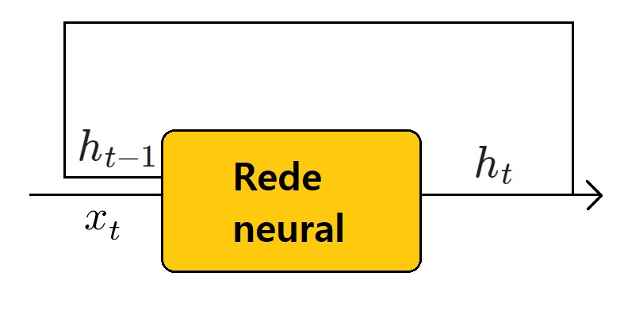

# Long Short-Term Memory

Entra uma sequência de inputs $\{x_1, x_2, ...\}$

As saídas são $\{h_1, h_2, ...\}$

Para gerar $h_t$, usa-se $x_t$ e $h_{t-1}$, com $h_0 = 0$ // até aqui é **Recurrent** Neural Network ou RNN

Além disso, o sistema possuirá memória $c_t$, e para controlarmos a memória faremos "três redes neurais extras", de forma que o LSTM, no final, são 4 em 1.

Quais três? 

- Uma que controle **quais** informações salvar na memória: $i_t$
- Uma que decide se/como usar a memória: $o_t$
- Por fim, uma que decide se apaga ou não a memória: $f_t$

Todas irão agir apenas sob a forma de "portas lógicas", sendo vetores em $(0,1)^n $ (para algum $n$) e fazendo produto elemento a elemento com outros vetores. Por isto foram denotados por $-_t$, que representa tal porta lógica no instante $t$.

Denotaremos o resultado da rede neural "original" (que não é nenhuma das três acima) por $\overline{c}_t$. Isto se deve ao fato de $\overline{c}_t$ sofrer alterações das outras três **após** o resultado desta rede neural, até que enfim obtemos $h_t$.

Especificamente:
$$ f_t = \sigma_g(W_fx_t + U_fh_{t-1} + b_f), \\ i_t = \sigma_g(W_ix_t + U_ih_{t-1} + b_i),
 \\ o_t = \sigma_g(W_ox_t + U_oh_{t-1} + b_o), \\ \overline{c}_t = \sigma_c(W_cx_t + U_ch_{t-1} + b_c),
 \\ c_t = f_t \odot c_{t-1} + i_t \odot \overline{c}_t, \\ h_t = o_t \odot \sigma_h(c_t),$$

onde $\sigma_g = \frac{1}{1+e^{-x}}$ é a sigmoid (portanto entre 0 e 1), $\sigma_c = \frac{e^x - e^{-x}}{e^x + e^{-x}}$ é a tangente hiperbólica, e $\sigma_h$ pode ser a tangente hiperbólica ou identidade. 

Existem algumas variações de LSTM, uma delas é "peephole", onde o output $h_t$ não é usado como em RNN's clássicas, normalmente substituído pela memória $c_t$.